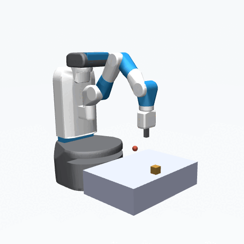
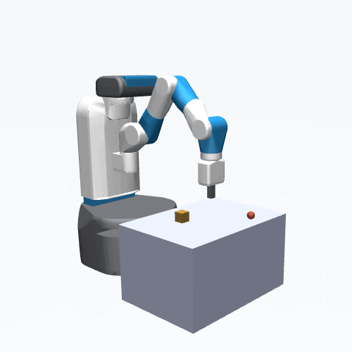
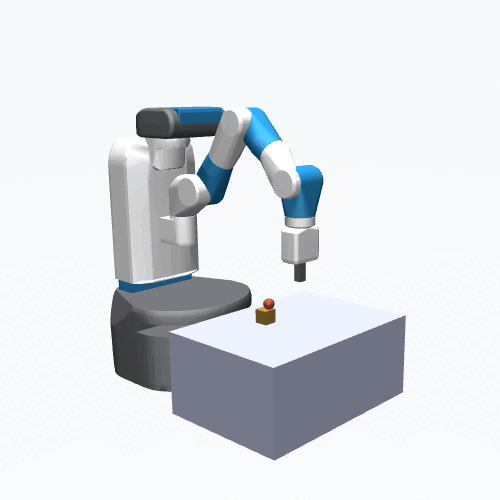
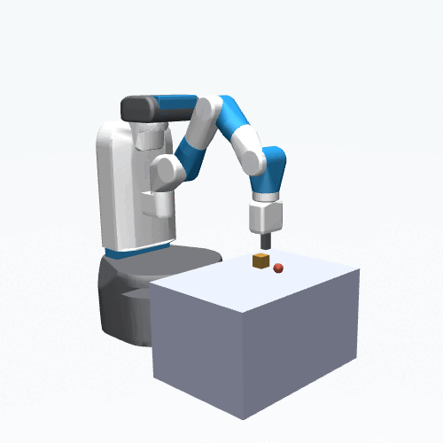

# FPP_sequences

Sequences from Fetch Pick&amp;Place simulation useful for training models or offline RL algorithms.

There are two types of sequences: scripted or APEX

## Scripted
Here the motor commands are scripted with some motor noise added. There are 3 different types of event sequences 

  

- **grasp**: Gripper moves to object, closes its fingers, and lifts the object to the goal position.
- **point**: Gripper moves to goal position.
- **stretch**: Arm repeatedly performs same, randomly generated motor command

Scripted sequences exist for the *vanilla* simulator or with *varying table height*. Originally used in our [2022 ICDL paper](https://arxiv.org/abs/2206.02042).


## APEX
Motor commands are generated by the policy-guided model-predictive control method [APEX](https://martius-lab.github.io/APEX/).
There are two types of sequences:

  

- **full**: Contains any type of sequence discovered by APEX, including highly creative ways to interact with the object.
- **grasp**: Filtered sequences to only include ones where the object is reached, fully grasped, and lifted to the goal without dropping it. 

If you use APEX sequences in your work, please cite the original publication:
```
@inproceedings{pinneri2021:strong-policies,
  title = {Extracting Strong Policies for Robotics Tasks from Zero-order Trajectory Optimizers},
  author = {Pinneri*, Cristina and Sawant*, Shambhuraj and Blaes, Sebastian and Martius, Georg},
  booktitle = {9th International Conference on Learning Representations (ICLR 2021)},
  month = may,
  year = {2021},
  note = {*equal contribution},
  doi = {},
  month_numeric = {5}
}
```
